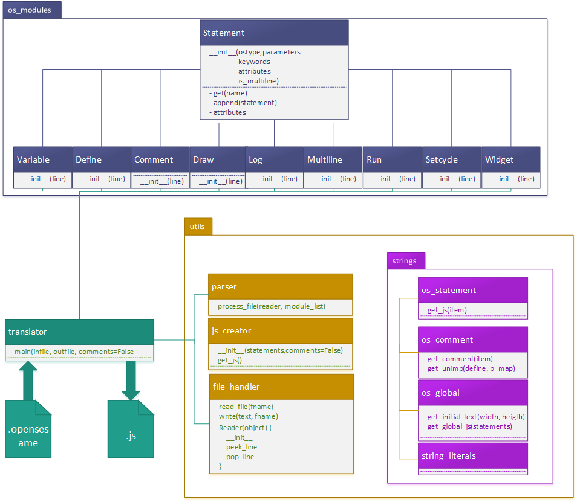

# The OpenSesameOnline Translator engine.

The OpenSesameOnline translator engine transforms a .opensesame file for an offline experiment into a .js file with correct JavaScript syntax that can be run in the webbrowser.

## Running the translator:
The translator.py file includes the main function that takes three parameters:
- infile: The location of the .opensesame file.
- outfile: The location and filename where the translator will store the resulting .js file.
- comments: This parameter specifies if the .js file will include comments about unimplemented parts of the .opensesame script. Default: False. Useful for debugging.

# Expanding the functionality of the translator.

## File handling:

All the functionality around files is centered in the file_handler in the utils directory. This supplies a read_file and a write function in order to read and write files.
Also, a Reader class is included here, that can peek and pop a line from the opensesame file. This is used in the parder.

## The os_modules:
Currently there are 9 OpenSesame modules implemented in the parser:
- Variable  (set <var name> <value>)
- Define
- Comment
- Draw
- Log
- Multiline
- Run
- Setcycle
- Widget

Each of these modules includes regular expression that will be used in the parser to see if a line in the .opensesame file matches this module.
Other functionality includes:
- get(name): Gets the value of the the matching name for this OpenSesame statement. For example: A variable statement has get('name') that returns the name of the variable and get('value') that returns the value of the variable
- append(statement): This functionality is currently only used for the define statement, in order to append the OpenSesame statements that belong to the define.
- attributes: Returns a list of not standard attributes for this statement. For example all the key-value pairs in a draw statement.

## Parsing the opensesame file:

The process_file function is a relatively complex part of the translator. It requires a Reader object (from the file_handler) and a module_list (list of possible os_modules)
The basic functionality is to read the .opensesame file line by line, and match it to the corresponding os_module. (Draw, Comment, Variable...) It will try to match the line to the list of os_modules in order. So if more then one os_module matches, the translator will pick the first match.

There are two special cases here.
- When a define element is encountered, the translator will switch to 'define' mode, appending all indented statements to the last encountered define.
- When a multiline start is encountered, it will append all following lines to the multiline until a multiline end is encountered.

## Creating the javascript file

The js_creator file in the utils folder handles the translation from OpenSesame statements to javascript. Call __init__ with a list of parsed os statements. When then get_js is called, it returns a lift of strings that can be printed to a file.

### string_literals

This file in the strings subdirectory includes all literal .js strings that will be used in the creation of the javascript file. Please change things here when only textual changes are needed. For changes in the output logic, the other files are required.

### os_statement
os_statement supplies the get_js function that can be passed a OpenSesame statement. This function will translate the statement into matching javascript. In case of define statements, it will also create the javascript of all sub items.

### os_comment
The os_comment file supplies two functions: get_comment(item) returns a js comment for the given os_statement
get_unimp that is passed a define statement, and a list of parameters that are implemented, returns javascript comments for all unimplemented statements in this define

### os_global
This file supplies functions to get the general texts for the output js file, for example the initial text that also specifies the width and height of the experiment.

# Architecture overview:

